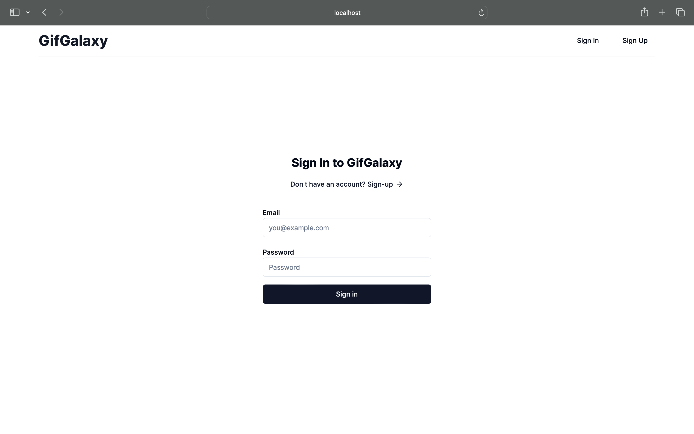

# Giphy App

This project was developed as part of the interview task for AlphaBI.

## Deployed Link

-   <a target='_black' herf='https://vercel.com/ibrahimghasia/gif-galaxy-task'>https://vercel.com/ibrahimghasia/gif-galaxy-task</a>

## Overview

The Giphy is a web application that allows users to explore trending GIFs, search for specific GIFs, and add their gifs to favourites. The app leverages the Next.js framework, Tailwind CSS for styling, ShadCn Component Library for UI components, Firebase for authentication and storage, the Giphy API for fetching GIFs, Zod for data validation, and React Hook Form for form management.

## Features

-   **Trending GIFs:** The app showcases trending GIFs to keep users updated with the latest and most popular animated content.

-   **Search Functionality:** Users can search for specific GIFs by entering keywords, making it easy to find content tailored to their interests.

-   **Favorite GIFs:** The app allows users to mark their favorite images with a star, creating a personalized collection of preferred GIFs.

-   **User Authentication:** To use the app, users must first sign up and log in, ensuring a personalized and secure experience.

-   **User Profile Information:** The app provides detailed information about GIF uploaders, including their username, profile picture, and description.

-   **Mobile-Friendly Design:** The Giphy App is designed to be fully responsive and mobile-friendly, ensuring a seamless experience on various devices.

## Technologies Used

-   Next.js
-   Tailwind CSS
-   ShadCn Component Library
-   Firebase (Authentication and Storage)
-   Giphy API
-   Zod (Data Validation)
-   React Hook Form

## Screenshots

## Getting Started

To run the project locally, follow these steps:

1. Clone the repository: `git clone https://github.com/your-username/giphy-app.git`
2. Install dependencies: `npm install`
3. Set up Firebase: Add your Firebase configuration in the appropriate files.
4. Run the development server: `npm run dev`
5. Open your browser and visit `http://localhost:3000` to view the app.

Feel free to explore and enjoy the world of animated delights with the Giphy App!
